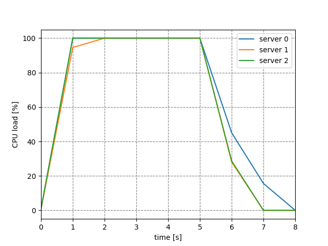

# Working with Remote Servers

**Requirements**

* At least one Ubuntu based remote server with your SSH key placed

* Fabric3 (https://github.com/mathiasertl/fabric/) installed:
`   pip install Fabric3`

* PyCharm Professional 2017.3+ (https://www.jetbrains.com/pycharm/)
  -- _note that the Community edition has no remote development capabilities_
  
## Deep Learning with PyCharm on your Netbook
Configure a Python remote interpreter to run your code remotely as if it were local. 

**Tools > Deployment > Configuration** from the main menu and enter the configuration details. Switch to the 
**Mappings** tab and enter a deployment path (where your files are copied to on the remote server).  
 
 
Then go to **Settings > Project: <Your Project Name> > Project Interpreter > Gear icon > Add Remote …**
and select your deployment configuration you just added and specify the Python interpreter path.

Make sure your run configuration uses your newly created interpreter and press **Run** and view
the live output of your remotely run progam in the integrated console:
 
 
 
## Syncing Data within JetBrains IDEs

Once you created a deployment configuration you can easily browse your remote server and download/upload/compare files.


## Setup Machines & Deploy your Code

**Getting started**

fabfile.py:
```python
from fabric.api import *

env.servers = ['user@<server1>:22','user@<server2>:22','user@<server3>:22']

env.roledefs['servers'] = env.servers

@task
@roles('servers')
@parallel
def install():
    sudo("apt-get update")
    sudo("apt-get install dstat dtach")
 ```
 
run this with `   fab install` (within the directory containing fabfile.py)
 
**Defining an experiment**
```python

@parallel
def experiment():
    run(dtach_and_log("dstat --output dstat.log 1 8", "tmp.log", "/dev/null"))
    with settings(warn_only=True):
        run('rm dstat.log')
        run('seq 3 | xargs -P0 -n1 timeout 5 md5sum /dev/zero')
    time.sleep(8)
    get("dstat.log", "logs/%(host)s")
 ```
 

## Process your Data
 
```python
def process():
    processed = pd.DataFrame()
    plt.figure()
    for i, logfile in enumerate(env.servers):
        df = pd.read_csv('logs/' + logfile, index_col=False, header=1, skiprows=5)
        processed['cpu' + str(i)] = 100 - df['idl']
        processed.plot()
        plt.xlabel('time [s]')
        plt.ylabel('CPU load [%]')
        plt.grid(color='gray', linestyle='dashed')
    plt.savefig('imgs/load.png')
    processed.to_csv('processed.csv')
```


```python
@task
def runExp():
    execute(experiment, hosts=env.servers)
    process()
```

since we defined a task we can run the experiment with `   fab runExp`
This task will execute the experiment on the remote server, aggregate the results we get following result:
 

 
 